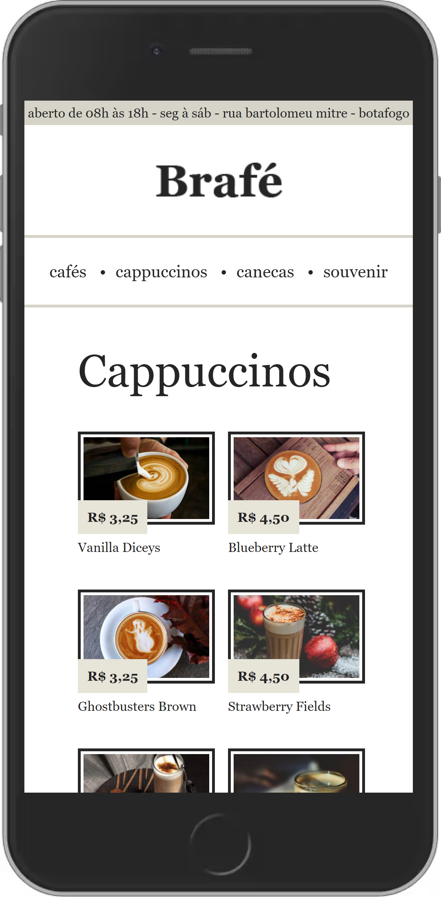
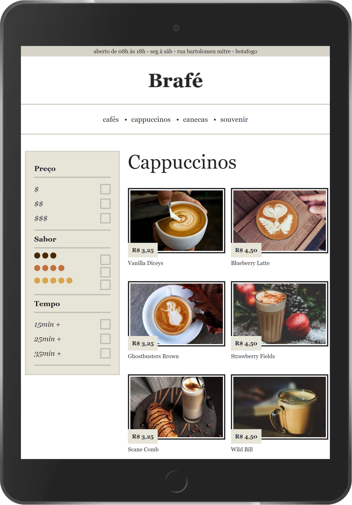
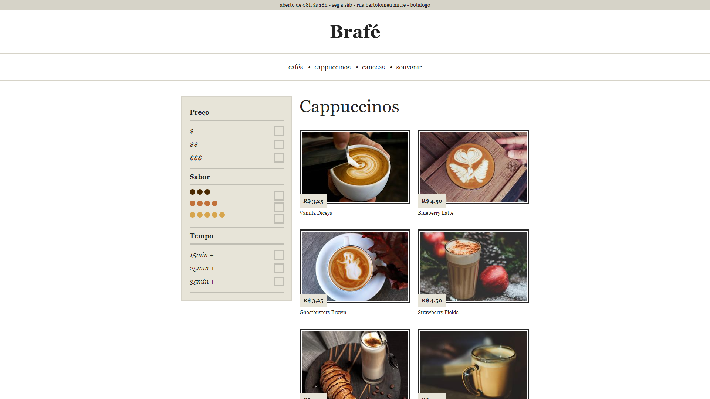

<h1 align="center">Brafé 02 - Flexbox</h1>

# O projeto
Projeto desenvolvido durante o curso "CSS Avançado Posicionamento" da Origamid - https://www.origamid.com/curso/css-avancado-posicionamento/ -
focado em desenvolver uma página home para um site de uma marca de café, com um layout responsivo e utilizando o Flexbox.

# Tecnologias utilizadas
- HTML
- CSS

# Como executar
```bash
- Utilizando o terminal:

  # Clone o repositório: 
  $ git clone https://github.com/HeloiseSantos/brafe02-flexbox.git

  # Abra o projeto em uma IDE (Preferencialmente no Visual Studio Code para utilizar a extensão abaixo)
  
  # Utilize a extensão Live Server para abrir um server local e visualizar a tela do projeto
  https://marketplace.visualstudio.com/items?itemName=ritwickdey.LiveServer
```

# Layout do projeto
<div align="center">
    
    
    
</div>